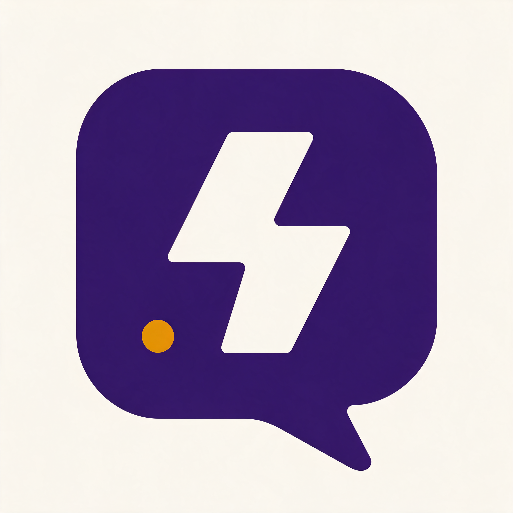

# lightning — host and present lightning talks

A small web app at `lightning.nakomis.com` for keeping talks, giving them, and
handing them out afterwards. Sign in, pick a talk from the panel on the left,
present it full-screen with your notes on a second display, record the room, and
share the deck with a link that needs no account.

## Support

If you find this useful, please consider buying me a coffee:

[](https://www.paypal.com/donate?hosted_button_id=Q3BESC73EWVNN&custom=lightning)

## Table of Contents

<!-- toc -->

- [Architecture Diagram](#architecture-diagram)
- [What it does](#what-it-does)
- [Access model](#access-model)
- [Repository Layout](#repository-layout)
- [Development](#development)
- [Deployment](#deployment)
- [Architecture Diagrams](#architecture-diagrams)
- [Support](#support)

<!-- tocstop -->

## Architecture Diagram


## What it does

| | |
|---|---|
| **Talk library** | A collapsible left panel, grouped into collections. Collapses away so the deck gets the whole window. |
| **Deck viewer** | Uploaded HTML decks rendered in a sandboxed frame, driven from the keyboard. |
| **Popout notes** | A second window for the other screen — current slide's notes, what's next, elapsed time. |
| **Recording** | Screen and microphone captured in the browser, uploaded to S3 once you've finished. |
| **Share links** | A permanent, unguessable URL per talk. No login, no expiry, revocable in one click. |

## Access model

Two layers, deliberately separate.

**Can you get in at all?** — membership of the single `lightning` group on the
shared nakomis Cognito user pool. No group, no app.

**What can you see?** — rows in DynamoDB, keyed on your verified email address:

| Role | May |
|---|---|
| `ro` | View, present and download talks in that collection |
| `rw` | Everything `ro` can, plus upload, edit, record, and mint or revoke share links |
| `admin` | Everything, plus administer this table |

Collections at launch are **Personal** and **TDS**. Adding another is a row, not
a deployment.

Keying on email rather than the Cognito `sub` is what lets the first admin be
seeded at deploy time without a lookup, and makes a grant read the way you'd say
it out loud: *give `someone@example.com` RW on TDS*.

## Repository Layout

| Path | What |
|---|---|
| `infra/` | CDK — the application stack and the GitHub OIDC CI role |
| `web/` | React SPA — Vite, Tailwind, Biome, Vitest |
| `api/` | Lambda handlers behind the HTTP API |
| `docs/architecture/` | Diagram source and its exported SVG |

## Development

```bash
pnpm install          # in each of infra/, web/, api/
pnpm dev              # web/ — Vite dev server
pnpm test             # unit tests with coverage
pnpm lint             # Biome
```

`pnpm`, not npm — and this matters. Dependencies resolve at home through a Nexus
proxy, and `package-lock.json` records a `resolved` tarball URL per package, so a
lockfile generated here hard-codes a host CI cannot reach. `pnpm-lock.yaml`
records name, version and a sha512 integrity hash with no URL, so the same
lockfile resolves from npmjs on a runner and Nexus on a laptop, and yields the
same tree.

## Deployment

```bash
pnpm deploy-sandbox   # infra/ — NPM_ENVIRONMENT=sandbox
pnpm deploy-prod      # infra/ — NPM_ENVIRONMENT=prod
```

Merging to `main` deploys sandbox unattended; production waits for approval on
the `production` GitHub environment.

## Architecture Diagrams

`docs/architecture/lightning.drawio` is the source for the diagram above. The SVG
is auto-regenerated on commit by the pre-commit hook in `.githooks/pre-commit`.

To activate the hook after cloning:

```bash
git config core.hooksPath .githooks
```

## Support

If you find this useful, please consider buying me a coffee:

[](https://www.paypal.com/donate?hosted_button_id=Q3BESC73EWVNN&custom=lightning)
